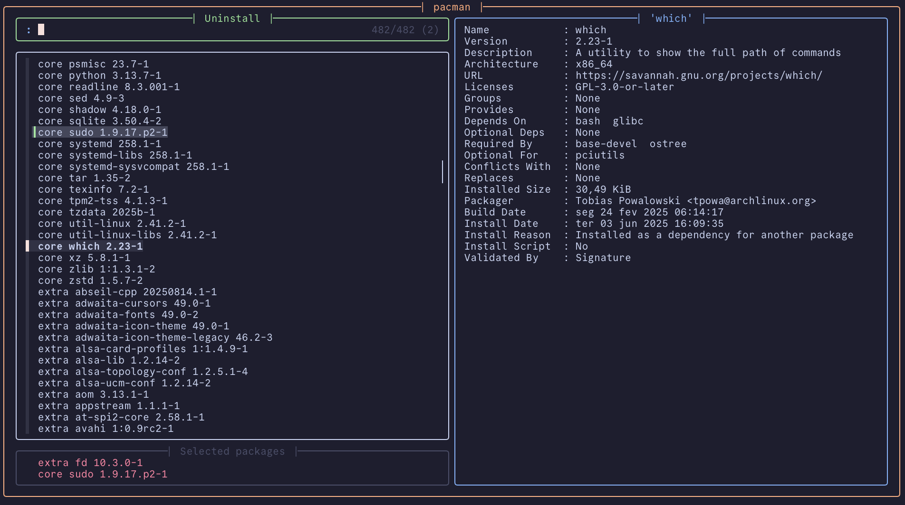

# pacmenu

An opinionated fzf-powered menu for Pacman

<p align="center">
    
</p>

## Dependencies

### Required
- [`fzf`](https://github.com/junegunn/fzf)
- [`tail`](https://github.com/coreutils/coreutils)
- [`tput`](https://github.com/mirror/ncurses)
- [`pkill`](https://gitlab.com/procps-ng/procps)

### Optional
- An AUR helper:
    - [`paru`](https://github.com/Morganamilo/paru)
    - [`yay`](https://github.com/Jguer/yay)
    - Others (not coded out of the box)

## Installation

### Clone the repository

```sh
git clone https://github.com/MisterKartoffel/pacmenu.git
cd pacmenu
```

### Ensure script is executable

```sh
chmod +x pacmenu.sh
```

## Usage

```text
Usage: pacmenu.sh [OPTIONS]

Options:
    -p, --package-manager [paru|yay]
            select alternative package manager to use, enabling the aur menu if applicable.

    -s, --start-mode [repos|aur|uninstall]
            allows starting from any of the three available menus.

    -r, --reinstall
            shows installed packages in the install menus with the "[installed]" tag.

    -h, --help
            show this help message.

Menu actions:
    Ctrl-s      Cycle between menus.
    Tab         Select current item.
    Enter       Submit selection.
```

## Acknowledgements

- [`bw-fzf`](https://github.com/radityaharya/bw-fzf) for being the first fzf menu script I dove deep into.
- User `id__a` of the [`Ghostty Discord Server`](https://discord.gg/ghostty) for their sneak peek of their own menu for brew, which inspired me to make this one (and from which the colors I stole).
