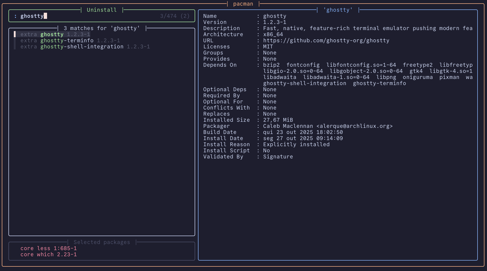

# pacmenu

An opinionated fzf-powered menu for Pacman

<p align="center">
    
</p>

## Requirements

- [`paru`](https://github.com/Morganamilo/paru)
- [`fzf`](https://github.com/junegunn/fzf)

## Installation

### Clone the repository

```sh
git clone https://github.com/MisterKartoffel/pacmenu.git
cd pacmenu
```

### Ensure script is executable

```sh
chmod +x pacmenu.sh
```

## Usage

```text
Usage: pacmenu.sh [OPTIONS]

Options:
    -s [MENU]   Start mode: allows starting from any of the three
                    available menus - repos, aur, uninstall
    -h          Help: show this help message.

Menu actions:
    Ctrl-s      Cycle between menus.
    Tab         Select current item.
    Enter       Submit selection.
```

## Acknowledgements

- [`bw-fzf`](https://github.com/radityaharya/bw-fzf) for being the first fzf menu script I dove deep into.
- User `id__a` of the [`Ghostty Discord Server`](https://discord.gg/ghostty) for their sneak peek of their own menu for brew, which inspired me to make this one (and from which the colors I stole).
